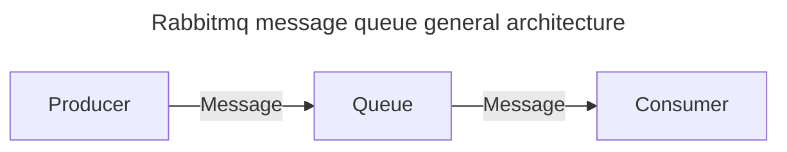
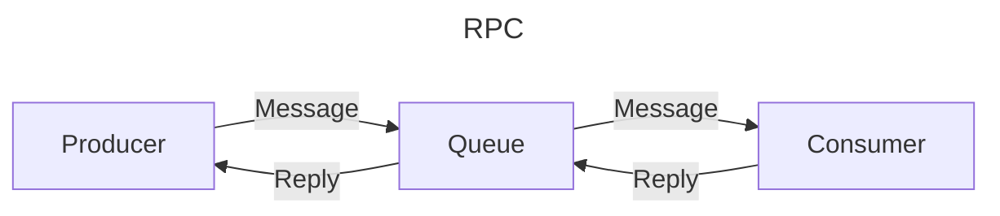
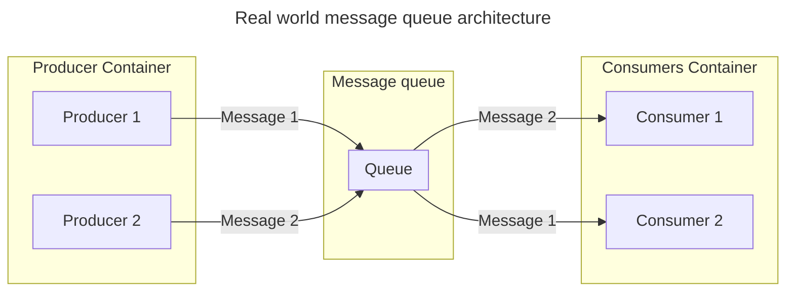

## Table of contents
* [General info](#general-info)
* [Architecture](#architecture)
* [Setup](#setup)
* [How to test](#how-to-test)

## General info
This project for investigating Rabbitmq features
Firstly focus on implementing RPC: https://www.rabbitmq.com/tutorials/tutorial-six-python.html

## Architecture
### General


### Remote call procedure (RPC)


### Detailed message queue architecture
In real world, we can have many Producers and many Consumers


### Solution for sending reply to originated Producer

Rabbitmq Direct Reply-to
Ref: https://www.rabbitmq.com/direct-reply-to.html

## Setup
- Docker (for running rabbitmq): https://docs.docker.com/engine/install/
- Nodejs (for running apps): https://nodejs.org/en
- Install yarn: https://classic.yarnpkg.com/lang/en/docs/install/#mac-stable
- Install dependencies for apps
```bash
cd apps \
yarn
```
## Start services
- Rabbitmq
```bash
cd rabbitMq \
docker-compose up
```
- Producer 1
```bash
cd apps \
yarn workspace producer start
```
- Producer 2
```bash
cd apps \
PORT=3001 yarn workspace producer start
```
- Consumer
```bash
cd apps \
yarn workspace consumer start
```
## How to test

- Make multiple request to Producer 1:
```bash
curl http://localhost:3000/produce
```
- View response in console of Producer 1 from Reply queue after message processed in Consumer

- Make multiple request to Producer 2:
```bash
curl http://localhost:3001/produce
```
- View response in console of Producer 2 from Reply queue after message processed in Consumer
